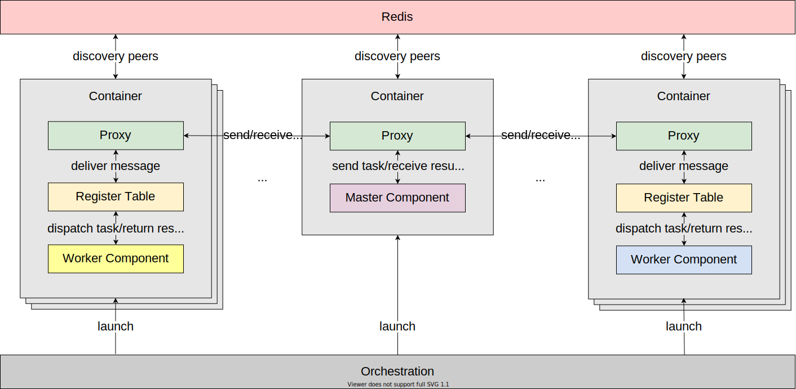

# Distributed Toolkit

MARO distributed toolkit provides a unified, fast, and infrastructure-independent
interface to support RL distributed training.

As shown in the overall architecture diagram above, MARO distributed toolkit
follows a message-passing pattern that the cooperation between different components
is based on the messages sending and receiving. A typical master/worker distributed
program usually contains the following steps:

1. The master component will send tasks(w/ or w/o data) to the worker components;
2. The worker components will finish the tasks in their local computing environments
or the local devices;
3. The worker components return the computed results to the master component.

According to the actual needs, the communication mode between master and worker
components can be synchronous or asynchronous.

## Key Components

There are two key components in the distributed toolkit:

- **Communication**: It provides the general message passing interfaces, such as
`(i)send`, `receive`, `(i)broadcast`, `(i)scatter`, etc. The communication
component use a replaceable communication protocol driver to adopt different
communication protocol stack (e.g. [TCP/IP](https://en.wikipedia.org/wiki/Internet_protocol_suite),
[InfiniBand](https://en.wikipedia.org/wiki/InfiniBand#:~:text=InfiniBand%20(IB)%20is%20a%20computer,both%20among%20and%20within%20computers.)
). Check the [distributed communication](./communication.html) to get more details.

- **Orchestration**: It primarily provides a unified interface for cluster
management and job management on different infrastructures. Check the
[distributed orchestration](./orchestration.html) to get more details.
