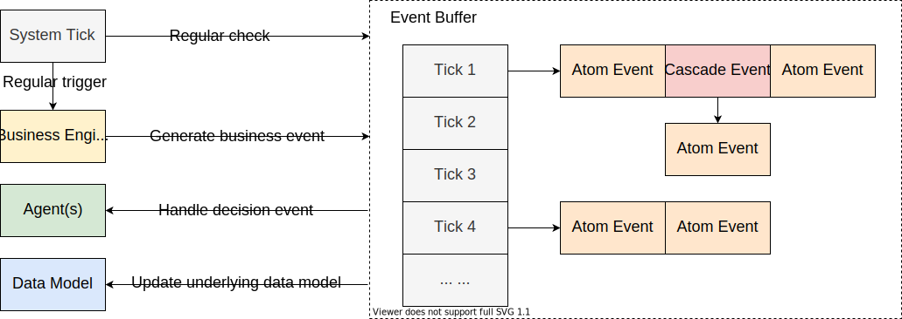

# Event Buffer

Event buffer is the execution engine of the MARO simulation system. Various
business scenarios are constructed by different business event series and the
related handler functions. To implement a scenario-specific environment, users
need to provide the definitions of business events and related handler functions.
After that, the input events of the event buffer will be automatically processed
based on their priority. The priority of an event is first determined by its
declared execution tick. Events of the same tick will be executed according to
the FIFO rule. Currently, only a single-thread version event buffer is provided.

```python
# Initialize an event buffer.
event_buffer: EventBuffer = EventBuffer()

# Insert a mock event.
event_buffer.insert_event(event)

# Execute events at a specific tick.
executed_events = event_buffer.execute(tick)
```



## Event Category

To simplify the implementation of the business logic, MARO provides two kinds of
basic event types, which can be used to construct various event execution pattern:

- **Atom event** is an event without any dependence. An atom event will be
immediately popped out from the event buffer after execution.
- **Cascade event** is a series of events with dependencies. An internal event
queue is hosted for the sub-events of each cascade event. Only after all
sub-events executed, a cascade event can be popped out from the event buffer.
Furthermore, the cascade event is chainable, which means that events in the
internal event queue can also be cascade events.

## Event Format

We provide a general-purpose event format for all the scenarios in MARO. A legal
event generally contains the following properties:

- **tick** (int): The execution tick of this event.
- **event_type** (int): The type of this event. It is a customized field, the
default value is 0 (PREDEFINE_EVENT_ACTION).
- **source** (str): The id/code of the event generator (not implemented yet).
- **target** (str): The id/code of the event receiver (not implemented yet).
- **payload** (Object): It is used to transfer sufficient information to the
event handler.
- **tag** (EventCategory): The tag of the [event category](#event-category).
Valid values include ATOM and CASCADE.
- **immediate_event_list** (list): The sub-event queue of the cascade event.
Atom event does not have this field.
- **state** (EventState): The state of this event. Valid values include PENDING,
EXECUTING and FINISHED. The figure below indicates the state changing of an event:


